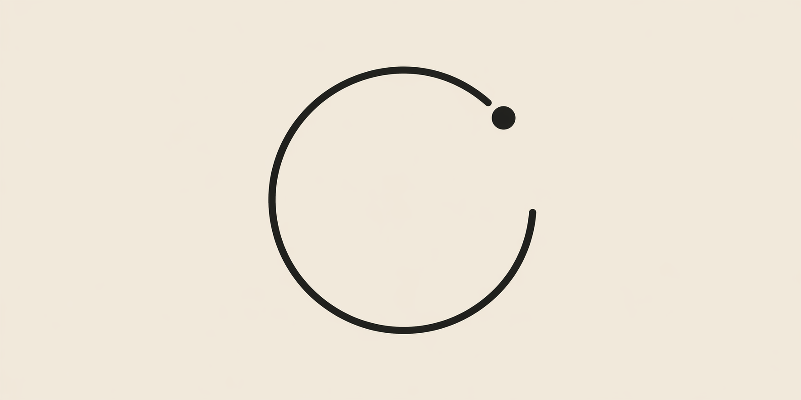

# LapLog

A minimalist iOS stopwatch with **renamable laps**. Built for tracking real-world moments — meats on a grill, intervals in a workout, stages of anything — where anonymous "Lap 3" isn't good enough.

Native SwiftUI. iOS 26.4+.

## Why

The stock iOS Stopwatch is great, but its laps are just numbers. If you're flipping a ribeye, pulling asparagus, and resting a steak in the same session, you end up counting rows in your head. LapLog keeps the stopwatch simple and adds two things: a name on every lap, and a session archive so yesterday's cook is still there tomorrow.

## Features

- **Editable laps** — tap any lap row to rename it inline. Type a name for the *current* running lap right in the lap list; hit Lap and it commits with that name.
- **Long-press quick picks** — grill-focused presets (`Steak flip`, `Coals ready`, `Sear`, `Veg on`, …) so you don't fight iOS autocorrect mid-cook. Also has a one-tap Delete.
- **Editable session title** — tap "SESSION · NAME" in the top-left to rename. Auto-resets to "New" after a reset.
- **Session history** — every Reset archives the current session (including the in-progress lap) into a sliding History panel.
- **Session detail view** — tap a history row to see all laps, cumulative times, and durations. Rename sessions and individual laps after the fact.
- **Three themes** — *Warm light*, *Paper* (default), and *Dark* (inverted paper: deep brown-black bg, tan text).
- **Accent picker** — five fixed accents plus one theme-aware black/paper swatch. Theme changes auto-swap the monochrome accent so the Start button never blends into the background.
- **Display options** — toggle big numerals and toggle the long-press quick-picks menu.
- **Export** — copy the current lap list to the clipboard as plain text.

## Design

The UI was prototyped in HTML/CSS/JS via Claude Design and ported to native SwiftUI. Type is SF Pro Rounded with tabular numerals for the timer, monospaced caps for status strings, and a single accent color running through the controls and ring. A 60-second progress ring sits behind the readout to give a subtle sense of motion without distracting from the numbers.

## Project structure

```
LapLog.xcodeproj/
LapLog/
├── LapLogApp.swift       # @main entry point
├── ContentView.swift     # Main screen: top bar, timer, controls, lap list host
├── AppState.swift        # ObservableObject — stopwatch, laps, history, settings
├── Models.swift          # Lap, Session, AppTheme, Palette, color helpers
├── TimeFormat.swift      # MM:SS.CS / HH:MM:SS.CS formatting
├── Components.swift      # IconCircle, TimeReadout, SecondHandRing, RoundButton,
│                         #   PulseDot, EditableSessionTitle
├── Laps.swift            # LapsListView, CurrentLapRow, LapRow, QuickPickSheet,
│                         #   FlowLayout, EmptyState
├── Overlays.swift        # OverlayShell, HistoryPanel, SessionDetailView,
│                         #   MenuSheet, SettingsPanel
└── Assets.xcassets
```

## Build & run

Requires Xcode 26+ with an iOS 26.4+ simulator runtime (or a physical device running iOS 26.4+).

```bash
open LapLog.xcodeproj
# then: Product ▸ Run (⌘R)
```

Or from the command line:

```bash
xcodebuild -project LapLog.xcodeproj -scheme LapLog \
  -destination 'platform=iOS Simulator,OS=26.4.1,name=iPhone 17 Pro' \
  -configuration Debug build
```

Bundle identifier: `com.javierorraca.LapLog`.

## Status

Demo app — single in-memory session history is seeded on launch; nothing is persisted across app restarts yet. Suitable for prototyping, not for your cook-of-the-year.

## Status & contributions

LapLog is an in-development personal project. I appreciate eyes on the code but I'm not actively accepting PRs or feature requests right now. If you spot a real bug feel free to open an issue.
